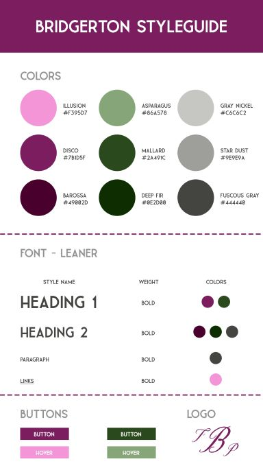
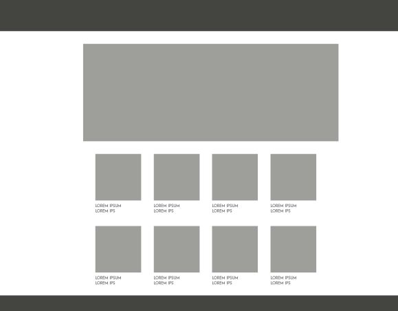
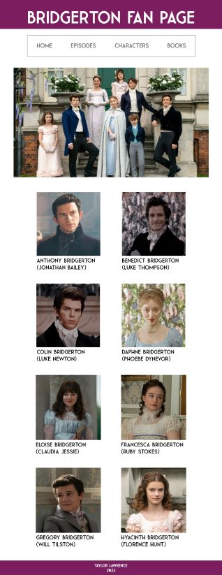

# bridgerton-fan-page
A website dedicated to the Bridgerton television series. 

Because I wasn't able to do this assignment as a group, I decided to try to do as many of the group leader steps as possible. I created a second github account (13ashdog13) and I added myself as a contributor to this repository. I also set up the branch protection rule like I would have if this were a group project. 

Link to live site: https://tlawrence95.github.io/bridgerton-fan-page/index.html 

Challenges and comments:
This was definitely a difficult assignment to do by myself and in a limited amount of time. It was interesting trying to remember all of the different things we've covered during the semester so I was glad to have the previous assignments to be able to look back on when I had questions. I have so many ideas that I would love to incorporate like embedded videos, but I just don't have the knowledge base yet to be able to do so. It definitely makes me want to keep learning and developing those skills!

Styleguide: 
 

 
 
Wireframe - Episodes: 
 

 

 

 
 
Mockup - Episodes: 
 

 

 

 
 
Wireframe - Characters: 
 

 

 

 
 
Mockup - Characters: 
 

 

 

